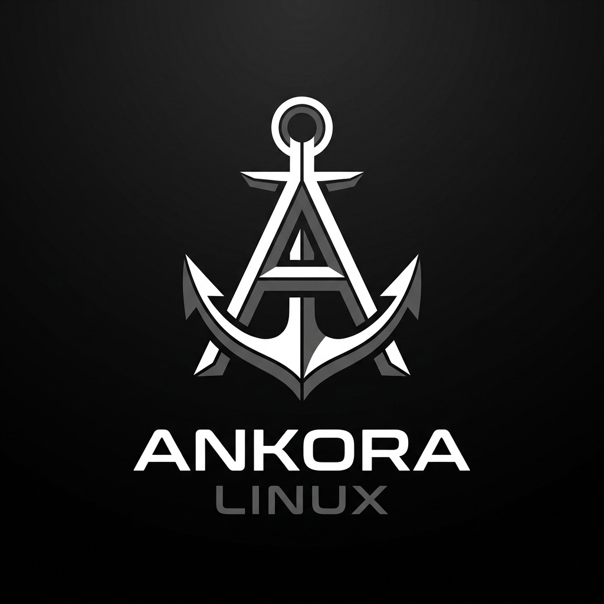
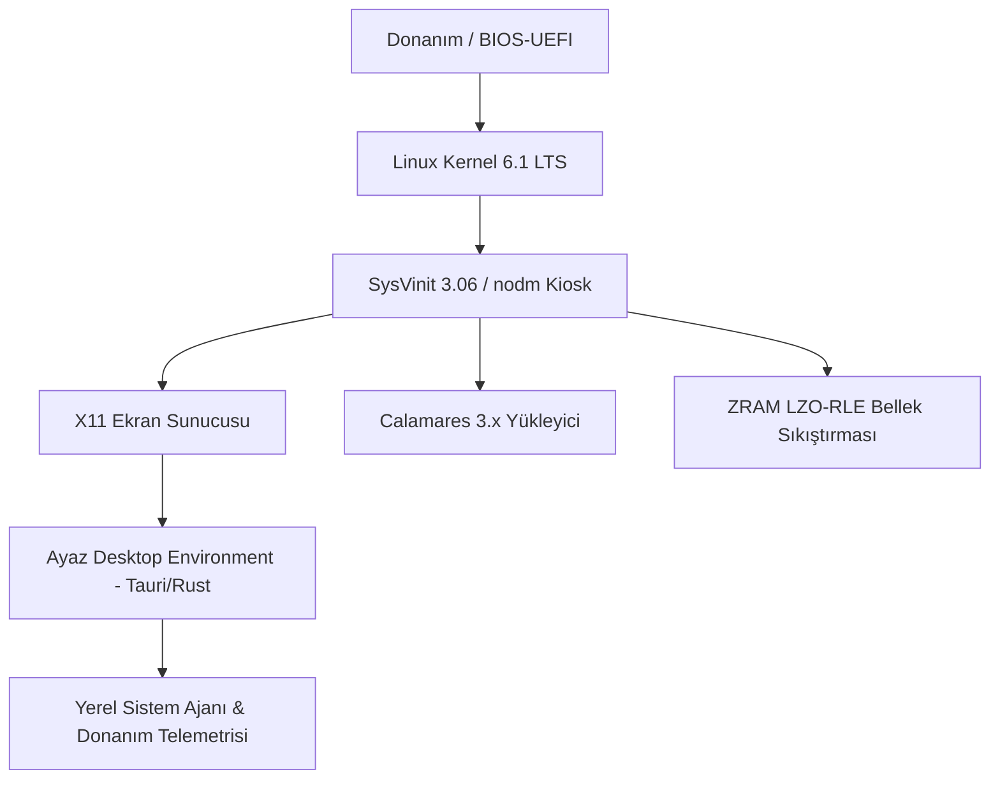

<div align="center">
  
  <br><br>
  <h1>Ankora Linux (Ankora OS)</h1>
  <p><b>Devuan Daedalus Tabanlı, Systemd-Free, Ultra Hafif ve Kiosk Odaklı Bağımsız Linux Dağıtımı</b></p>

  <p>
    
    
    
    
    
  </p>
</div>

---

## 📌 Ankora Linux Nedir?

**Ankora Linux**, düşük donanım kaynaklarına sahip bilgisayarlardan modern kiosk terminallerine kadar yüksek tepkisellik ve sarsılmaz kararlılık sunmak üzere tasarlanmış, systemd kirliliğinden arındırılmış bağımsız bir **Devuan GNU/Linux** dağıtımıdır.

Sistem, geleneksel UNIX sadeliğini koruyan **SysVinit (PID 1)** çekirdeği ile çalışır. Varsayılan grafik arayüzü olarak resmi masaüstü ortamı olan **[Ayaz Desktop Environment (Ayaz DE)](https://github.com/Ankora-Linux/Ayaz)** ile birlikte gelir.

---

## 🏛️ Temel Sistem Mimarisi



### 1. Systemd-Free ve SysVinit Tabanı
Gereksiz arka plan daemon'ları, telemetri servisleri ve karmaşık ikili kayıt sistemleri (`journald`) yerine hafif, şeffaf ve kararlı SysVinit süreç kontrolü kullanılır. Sistem birkaç saniye içinde açılır ve boşta yalnızca ~80 MB RAM tüketir.

### 2. Resmi Masaüstü Ortamı: Ayaz DE
Ankora Linux'un resmi masaüstü arayüzü, bağımsız olarak geliştirilen **[Ayaz DE](https://github.com/Ankora-Linux/Ayaz)** projesidir.
* **Rust + WebKitGTK (Tauri 1.5):** Ağır GNOME/KDE kütüphaneleri olmadan doğrudan web teknolojileriyle donanım hızlandırmalı modern bir masaüstü.
* **Ayaz Güncelleyici:** Masaüstünden tek tıkla yeni `.deb` sürümlerini kurabilme.
* **Monokrom Cam Tasarım:** Windows 11 ve Chrome OS Flex esintili başlat menüsü ve minimalist estetik.

### 3. Calamares Grafiksel Yükleyici (`calamares/`)
Canlı (Live) ISO üzerinden sistemi kalıcı olarak hedef diske kurmak için özelleştirilmiş Calamares kurulum motoru entegre edilmiştir:
* Otomatik EFI (GPT) ve MBR (BIOS) disk bölümlendirme.
* Kiosk kullanıcıları için şifresiz otomatik oturum açma (`nodm`) yapılandırması.
* Donanım sürücülerinin kalıcı sisteme hatasız aktarımı (`unpackfs` ve `chroot`).

### 4. Kademeli Bellek Sıkıştırması (ZRAM Hiyerarşisi)
* **ZRAM (zram0):** RAM üzerinde LZO-RLE sıkıştırma alanı açarak disk I/O beklemesini ortadan kaldırır.
* **vm.swappiness & vm.vfs_cache_pressure:** Çekirdek parametreleri disk gecikmesini minimize edecek şekilde optimize edilmiştir.

### 5. Çevrimdışı Terminal AI Asistanı (`tools/yardimci`)
Uzak sunuculara veya API anahtarına ihtiyaç duymayan, doğrudan terminal içerisinden teknik komut referansı ve hata ayıklama desteği sunan yerel yardımcı araç.

---

## 📁 Depo Dizin Yapısı

```
Ankora-Linux/
├── assets/                     # Dağıtım logoları, açılış splash'ı ve masaüstü önizlemeleri
│   ├── ankora-logo.jpg         # Ankora Linux resmi logosu
│   ├── ankoraboot.png          # Canlı sistem önyükleme görseli
│   ├── desktop-preview.jpg     # Masaüstü çalışma alanı önizlemesi
│   └── logo.svg / logo.png     # Vektörel sistem rozetleri
├── calamares/                  # Calamares 3.x Grafiksel Kurulum Motoru
│   ├── settings.conf           # Kurulum adımları ve modül sıralaması
│   ├── branding/debian/        # Ankora Linux marka teması, karşılayıcı ve slaytlar
│   └── modules/                # Mount, users, fstab, bootloader vb. modül yapılandırmaları
├── config/                     # Canlı Sistem ve ISO İnşa Yapılandırmaları
│   └── refractasnapshot.conf   # Canlı ortamdan anlık ISO kalıbı çıkarma kuralları
├── tools/                      # Ankora Sistem Yardımcı Araçları
│   └── yardimci                # Çevrimdışı terminal AI asistanı betiği
├── LICENSE                     # MIT Lisansı
└── README.md                   # Dağıtım ana dokümantasyonu
```

---

## 💿 Sistem Gereksinimleri

| Donanım | Minimum Gereksinim | Önerilen Donanım |
| :--- | :--- | :--- |
| **İşlemci (CPU)** | 64-bit x86_64 Çift Çekirdek | 2.0 GHz+ Dört Çekirdek |
| **Bellek (RAM)** | 1.0 GB RAM | 2.0 GB veya üzeri |
| **Depolama** | 10 GB Boş Disk Alanı | 20 GB+ Hızlı SSD |
| **Grafik / Ekran** | 1024x768 çözünürlük | 1920x1080 Full HD (Kiosk Ekranı) |
| **Önyükleme** | Legacy BIOS veya UEFI | 64-bit UEFI |

---

## 🔧 Canlı Sistemden ISO Kalıbı Üretme

Ankora Linux canlı sistem imajı, özelleştirilmiş **Refracta Snapshot** altyapısı ile üretilir:

1. `config/refractasnapshot.conf` yapılandırmasını `/etc/refractasnapshot.conf` dizinine kopyalayın.
2. Root yetkisiyle kalıp çıkarma sürecini başlatın:
   ```bash
   sudo refractasnapshot
   ```
3. Üretilen `ankora-linux-2.0-amd64.iso` dosyası `/home/snapshot/` dizininde kullanıma hazır olacaktır.

---

## 🔗 İlgili Projeler ve Bağlantılar

* **Masaüstü Ortamı Deposu:** [Ayaz Desktop Environment (Ayaz DE)](https://github.com/Ankora-Linux/Ayaz)
* **Organizasyon:** [github.com/Ankora-Linux](https://github.com/Ankora-Linux)
* **Taban Dağıtım:** [Devuan GNU+Linux (Daedalus)](https://www.devuan.org)

---

## 📄 Lisans

Ankora Linux, **MIT** lisansı altında açık kaynak olarak dağıtılmaktadır.
