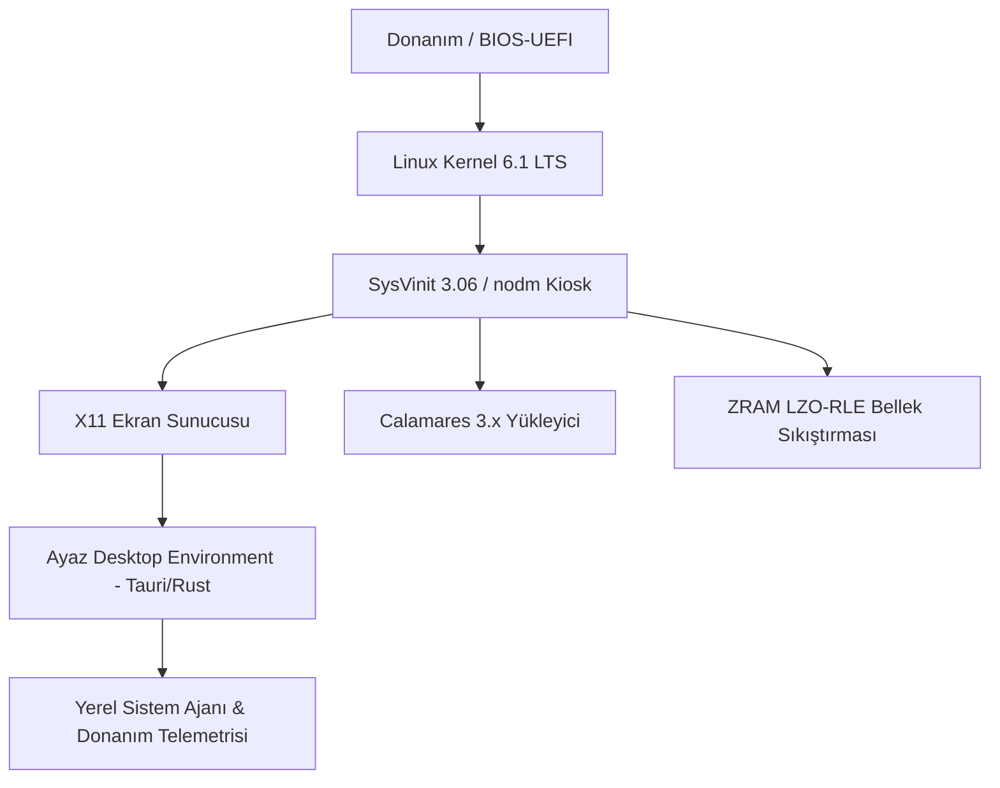

  <br><br>
  <h1>Ankora Linux (Ankora OS)</h1>
  <p><b>Devuan Daedalus tabanlı, systemd kullanmayan, kiosk odaklı bağımsız Linux dağıtımı</b></p>

  <p>
    
    
    
    
    
  </p>
</div>

## Ankora Linux nedir?

**Ankora Linux**, düşük donanımlı bilgisayarlar ve kiosk terminalleri için geliştirilmiş bağımsız bir **Devuan GNU/Linux** dağıtımıdır. Açılış ve süreç yönetimini geleneksel UNIX sadeliğinde **SysVinit (PID 1)** yürütür. Varsayılan masaüstü ortamı **[Ayaz Desktop Environment (Ayaz DE)](https://github.com/Ankora-Linux/Ayaz)**'dir.

## Temel sistem mimarisi


```mermaid
graph TD
    A[Donanım / BIOS-UEFI] --> B[Linux Kernel 6.1 LTS]
    B --> C[SysVinit 3.06 / nodm Kiosk]
    C --> D[X11 Ekran Sunucusu]
    D --> E[Ayaz Desktop Environment - Tauri/Rust]
    E --> F[Yerel Sistem Ajanı & Donanım Telemetrisi]
    C --> G[Calamares 3.x Yükleyici]
    C --> H[ZRAM LZO-RLE Bellek Sıkıştırması]
```

### 1. SysVinit tabanı

journald, telemetri servisleri ve gereksiz arka plan daemon'ları yerine SysVinit süreç kontrolü kullanılır. Sistem birkaç saniyede açılır, boşta ~80 MB RAM harcar.

### 2. Resmi masaüstü ortamı: Ayaz DE

Ankora Linux'un resmi masaüstü arayüzü bağımsız olarak geliştirilen **[Ayaz DE](https://github.com/Ankora-Linux/Ayaz)** projesidir:

* Rust ve WebKitGTK (Tauri 1.5) ile çalışır; GNOME/KDE kütüphanelerine gerek duymaz.
* Ayaz Güncelleyici yeni `.deb` sürümlerini masaüstünden kurar.
* Monokrom cam görünüm, Windows 11 ve Chrome OS Flex düzeninden esinlenir.

### 3. Calamares yükleyicisi (`calamares/`)

Canlı ISO'dan sistemi kalıcı diske kurmak için özelleştirilmiş Calamares kurulum motoru gelir:

* EFI (GPT) ve MBR (BIOS) için otomatik disk bölümlendirme.
* Kiosk kullanıcıları için şifresiz oto-oturum (`nodm`) yapılandırması.
* Donanım sürücülerini kalıcı sisteme aktarır (`unpackfs` ve `chroot`).

### 4. ZRAM bellek sıkıştırması

* **ZRAM (zram0):** RAM üzerinde LZO-RLE sıkıştırma alanı açar; sıkıştırılmış belleğe erişim disk I/O beklemesinden hızlıdır.
* **vm.swappiness ve vm.vfs_cache_pressure:** Çekirdek parametreleri disk gecikmesini azaltacak biçimde ayarlıdır.

### 5. Çevrimdışı terminal AI asistanı (`tools/yardimci`)

API anahtarı veya uzak sunucu gerektirmez; terminal içinden teknik komut referansı ve hata ayıklama desteği verir.

## Depo dizin yapısı

```
Ankora-Linux/
├── assets/                     # Dağıtım logoları, açılış splash'ı ve masaüstü önizlemeleri
│   ├── ankora-logo.jpg         # Ankora Linux resmi logosu
│   ├── ankoraboot.png          # Canlı sistem önyükleme görseli
│   ├── desktop-preview.jpg     # Masaüstü çalışma alanı önizlemesi
│   └── logo.svg / logo.png     # Vektörel sistem rozetleri
├── calamares/                  # Calamares 3.x grafiksel kurulum motoru
│   ├── settings.conf           # Kurulum adımları ve modül sıralaması
│   ├── branding/debian/        # Ankora Linux marka teması, karşılayıcı ve slaytlar
│   └── modules/                # Mount, users, fstab, bootloader vb. modül yapılandırmaları
├── config/                     # Canlı sistem ve ISO inşa yapılandırmaları
│   └── refractasnapshot.conf   # Canlı ortamdan anlık ISO kalıbı çıkarma kuralları
├── tools/                      # Ankora sistem yardımcı araçları
│   └── yardimci                # Çevrimdışı terminal AI asistanı betiği
├── LICENSE                     # MIT lisansı
└── README.md                   # Dağıtım ana dokümantasyonu
```

## Sistem gereksinimleri

| Donanım | Minimum gereksinim | Önerilen donanım |
| :--- | :--- | :--- |
| **İşlemci (CPU)** | 64-bit x86_64 çift çekirdek | 2.0 GHz+ dört çekirdek |
| **Bellek (RAM)** | 1.0 GB RAM | 2.0 GB veya üzeri |
| **Depolama** | 10 GB boş disk alanı | 20 GB+ hızlı SSD |
| **Grafik / Ekran** | 1024x768 çözünürlük | 1920x1080 Full HD (kiosk ekranı) |
| **Önyükleme** | Legacy BIOS veya UEFI | 64-bit UEFI |

## Canlı sistemden ISO kalıbı üretme

Ankora Linux canlı imajı, özelleştirilmiş **Refracta Snapshot** ile üretilir:

1. `config/refractasnapshot.conf` dosyasını `/etc/refractasnapshot.conf` dizinine kopyalayın.
2. Root yetkisiyle kalıp çıkarmayı başlatın:
   ```bash
   sudo refractasnapshot
   ```
3. Üretilen `ankora-linux-2.0-amd64.iso` dosyası `/home/snapshot/` dizininde hazır olur.

## İlgili projeler ve bağlantılar

* Masaüstü ortamı: [Ayaz Desktop Environment (Ayaz DE)](https://github.com/Ankora-Linux/Ayaz)
* Organizasyon: [github.com/Ankora-Linux](https://github.com/Ankora-Linux)
* Taban dağıtım: [Devuan GNU+Linux (Daedalus)](https://www.devuan.org)

## Lisans

Ankora Linux, **GPLV3** lisansı altında dağıtılır.
